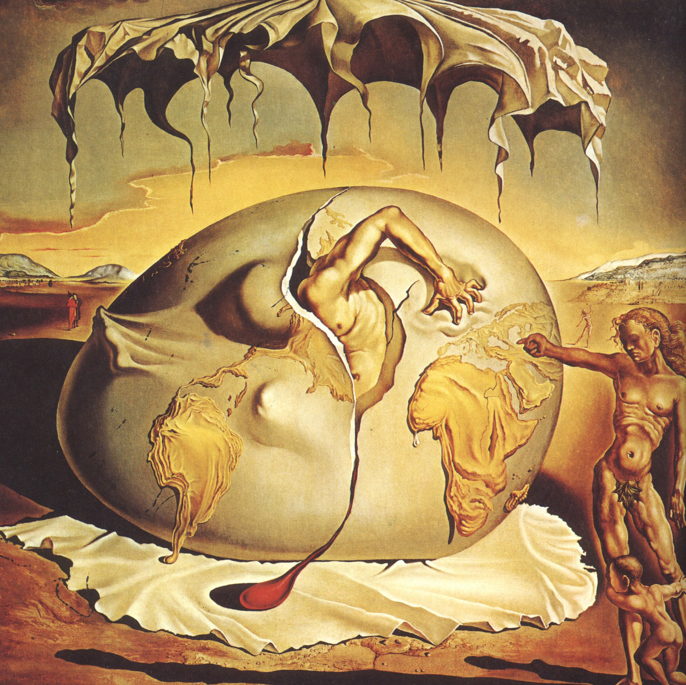
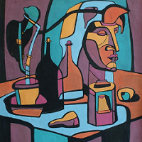

# Presto Renderized with Pretrained Models

This is the best way to train models and create renderized artworks quickly. 

# Prerequisites
- [Torch7](http://torch.ch/docs/getting-started.html) + [loadcaffe](https://github.com/szagoruyko/loadcaffe)
- cudnn + torch.cudnn (optionally)
- [display](https://github.com/szym/display) (optionally)

Download VGG-19.
```
cd data/pretrained && bash download_models.sh && cd ../..
```

### Training

#### Preparing image dataset

I recommend to download the MSCOCO: 
Training Images: http://msvocds.blob.core.windows.net/coco2014/train2014.zip
Validation Images: http://msvocds.blob.core.windows.net/coco2014/val2014.zip

Unzip the Images into dataset:
```
dataset/train
dataset/val
```
Download and create Symbolic Link to dummy: 
```
wget http://msvocds.blob.core.windows.net/coco2014/train2014.zip
wget http://msvocds.blob.core.windows.net/coco2014/val2014.zip
unzip train2014.zip
unzip val2014.zip
mkdir -p dataset/train
mkdir -p dataset/val
ln -s `pwd`/val2014 dataset/val/dummy
ln -s `pwd`/train2014 dataset/train/dummy
```

#### Training a network

```
th train.lua -data <path to any image dataset>  -style_image path/to/img.jpg
```
I recommend this params for test:
```
th train.lua -data datasets/ -style_image $style -style_size 1024  -model johnson -batch_size 4 -learning_rate 1e-2 -style_weight 10 -style_layers relu1_2,relu2_2,relu3_2,relu4_2 -content_layers relu4_2 -backend cudnn -save_every 10000
```
### Testing

```
th fast.lua -input_image source.jpg -model_t7 ./models/model.t7 -save_path out.png -image_size 0 -keep_color 0
```
```
-input_image Image to stylize. []
-image_size  Resize input image to. Do not resize if 0. [0]
-model_t7    Path to trained model.t7 []
-save_path   Path to save stylized image. [stylized.jpg]
-cpu         Use this flag to run on CPU [false]
-keep_color  Use keep color to keep original color. [0]
```
YOU could try Birth & composition. We put our pretrained models in ./models/


### Process

Stylize an image.
```
th stylization_process.lua -model data/out/model.t7 -input_image data/readme_pics/kitty.jpg -noise_depth 3
```
Again, `noise_depth` should be consistent with training setting.

# Hardware
- The code was tested with 8GB NVIDIA GTX 1080 on  Ubuntu 16.04 && Centos 7.
- You may decrease `batch_size`, `image_size` if the model do not fit your GPU memory.
- The pretrained models do not need much memory to sample.

# Credits

The code is based on [Justin Johnson's great code](https://github.com/jcjohnson/neural-style) for artistic style.
The work was supported by [Yandex](https://www.yandex.ru/) and [Skoltech](http://sites.skoltech.ru/compvision/).
Thanks to DmitryUlyanov.
